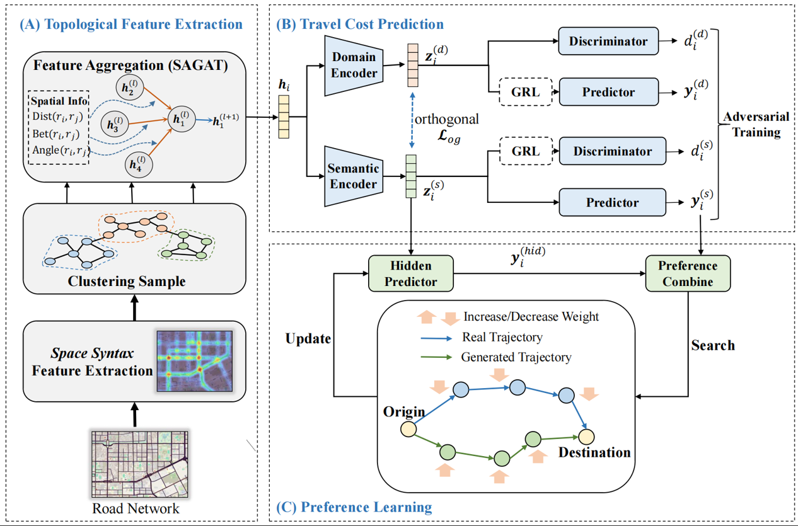

# GTG
Official repository of AAAI2025 under review paper "GTG: Generalizable Trajectory Generation Model for Urban Mobility".

## Overview

[//]: # (![Overview of the framework]&#40;./assets/framework.png&#41;)


Vehicle trajectory generation has emerged as a critical research area amidst the complexities introduced by rapid urbanization. 
However, due to factors such as privacy protection and deployment costs, collecting vehicle trajectory data is a long-term 
and difficult project. Learning human mobility from existing data and generate trajectory in urban area lacking data 
becomes a critical problem.
To address this problem, this paper proposes a **G**eneralizable **T**rajectory **G**eneration model (GTG). 
The model consists of three parts:
+ Cross-city topological feature extraction, which learns local topological features across cities;
+ Road segment cost prediction, which learns the cross-city mapping between topological features and travel costs; 
+ Travel preference learning, which updates the actual preference of each road segment by iterating the shortest path query and preference update. 
Preference means a combination of multiple travel cost types.
Our model surpasses existing models in multiple city data sets and multiple macro and micro metrics. 
Further experiments show that it is sufficient to replace real data for training downstream tasks. 
Finally, it was verified that after collecting trajectory data of new cities, 
the model has the ability to be fine-tuned and improved.


## How to run
#### Step1: Create a Python environment and install dependencies:
```angular2html
conda create -n gtg python=3.9
conda activate gtg
pip install -r requirements.txt
```

#### Step2: Prepare datasets
You can download the three processed datasets mentioned in the paper from 
[Google Drive](https://drive.google.com/file/d/1DZqKAOA1JDPQdniOw1byvRlOq5Kwh021/view?usp=sharing)
and put them into `./data` directory.

#### Step3: Start training GTG model 
You can start training by specifying the source city dataset and the target city dataset using the following command
```angular2html
python main.py --exp_tag 0 --src beijing --trg xianshi --device cuda:0
```
